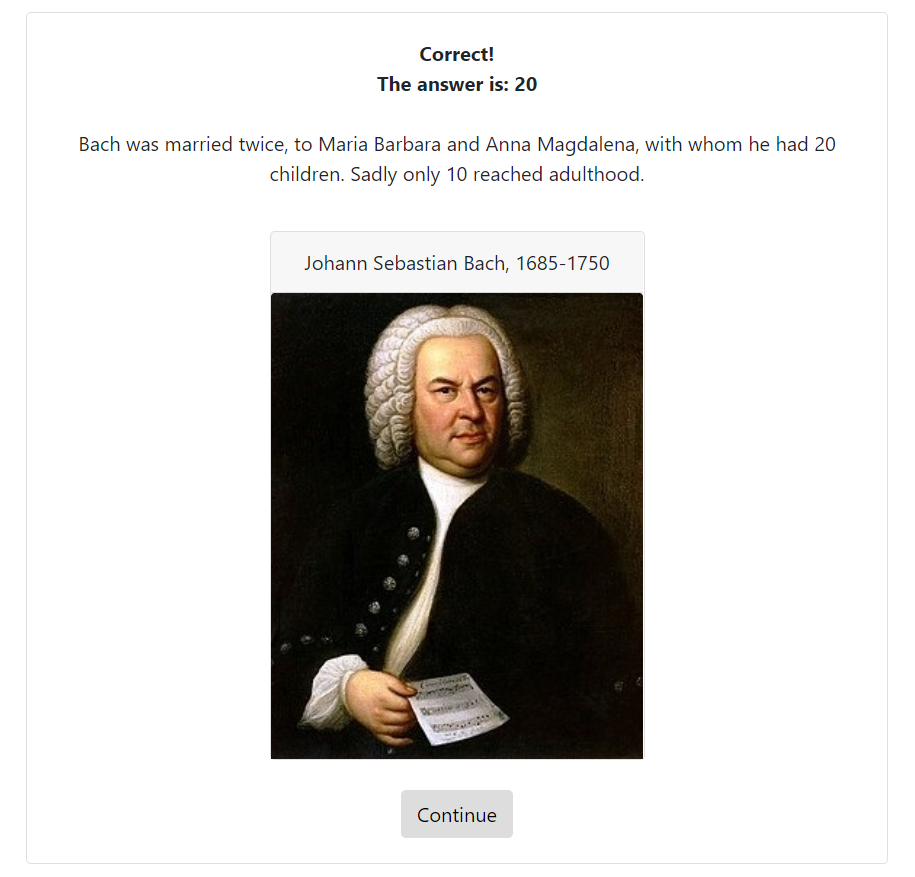

# TriviaGame

This web-based trivia game uses JavaScript to create a quiz about classical music. Each question is displayed for 25 seconds or until the player makes a choice by clicking on one of four options. The next screen will either indicate a correct answer, incorrect answer, or say "time's up" accompanied by the correct answer, an explanation, and a relevant picture with a caption. When all the questions are completed, a final screen will indicate how many correct, incorrect, or unanswered questions the player guessed during the quiz.

Screenshot:

